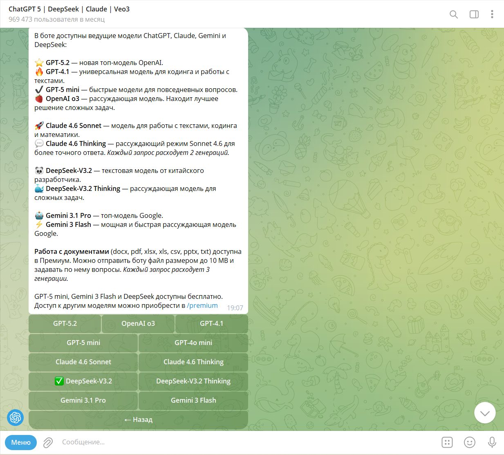

# Этап 1
В данном разделе представлены результаты исследовательской части курсовой работы. На основе анализа технического задания сформулированы функциональные и нефункциональные требования к разрабатываемому приложению, проведён обзор существующих аналогов и обоснован выбор инструментов для реализации.
## **1. Функциональные требования к клиентскому приложению (мессенджер)**

### **1.1. Авторизация и управление пользователями

На основе технического задания были выделены функциональные требования к клиентскому приложению-мессенджеру. Клиентская часть отвечает за взаимодействие с пользователем, предоставление интерфейса для общения, управления контактами и настройки параметров подключения к нейросетям.

Представленные в таблице ниже требования к авторизации являются базовыми для любого многопользовательского приложения. Особое внимание уделено безопасности: передача пароля в открытом виде исключена за счёт хеширования на стороне клиента. Сохранение сессии между запусками отнесено к опциональным требованиям, так как не влияет на основную функциональность, но повышает удобство использования.

| Требование                                         | Статус      | Пояснение                                                                  |
| -------------------------------------------------- | ----------- | -------------------------------------------------------------------------- |
| Регистрация нового пользователя по логину и паролю | Обязательно | Пароль хешируется на клиенте (например, SHA-256) перед отправкой на сервер |
| Вход зарегистрированного пользователя              | Обязательно | Клиент отправляет логин и хеш пароля, сервер сверяет с хранимым хешем      |
| Выход из аккаунта                                  | Обязательно | Разрыв соединения с сервером                                               |
| Сохранение сессии между запусками                  | Опционально | Хранение токена или хеша в локальном конфигурационном файле                |
#### **1.2. Контакты и чаты 

| Требование                                                      | Статус      | Пояснение                                                                                         |
| --------------------------------------------------------------- | ----------- | ------------------------------------------------------------------------------------------------- |
| Поиск пользователей по имени                                    | Обязательно | Клиент отправляет поисковый запрос на сервер, сервер возвращает совпадения из БД                  |
| Возможность начать чат с найденным пользователем                | Обязательно | Из результатов поиска можно создать новый чат                                                     |
| Автоматическое формирование списка чатов                        | Обязательно | Список чатов формируется на основе истории переписки (чаты, в которых пользователь уже участвует) |
| Отображение статуса онлайн/оффлайн для участников текущих чатов | Обязательно | Сервер рассылает обновления статусов только для тех пользователей, которые есть в чатах клиента.  |
| Создание групповых чатов                                        | Обязательно | Пользователь может выбрать нескольких участников и создать групповой чат                          |

При проектировании работы с контактами был выбран подход, аналогичный Telegram: пользователь ищет нужных людей через поиск. Это позволяет избежать избыточного трафика и ускоряет работу приложения. Статусы онлайн/оффлайн отображаются только для тех пользователей, с которыми уже есть общие чаты, что также снижает нагрузку на сервер.
### **1.3. Сообщения**

| Требование                                  | Статус      | Пояснение                                          |
| ------------------------------------------- | ----------- | -------------------------------------------------- |
| Отправка текстовых сообщений                | Обязательно |                                                    |
| Получение и отображение текстовых сообщений | Обязательно |                                                    |
| Загрузка истории сообщений при входе в чат  | Обязательно | Последние N сообщений (N настраивается на сервере) |
| Уведомления о новых сообщениях              | Обязательно | Подсветка чата или счётчик непрочитанных           |
| Системные уведомления                       | Опционально | Всплывающие уведомления операционной системы       |

Обмен сообщениями является основной функцией мессенджера. Требование загрузки истории сообщений обеспечивает непрерывность диалога: пользователь видит контекст переписки даже после перезапуска приложения. Системные уведомления вынесены в опциональные, так как их реализация требует **взаимодействия с API** операционной системы и может быть добавлена при наличии времени.
### **1.4. Нейросетевые ассистенты**

| Требование                                                    | Статус          | Пояснение                                                                                          |
| ------------------------------------------------------------- | --------------- | -------------------------------------------------------------------------------------------------- |
| Наличие системной учётной записи "Нейросетевой ассистент" | Обязательно | Один общий ассистент для всех пользователей. Создаётся автоматически при инициализации базы данных |
| Отображение ассистента в общем списке пользователей           | Обязательно     | Ассистент виден как обычный контакт                                                                |
| Возможность создания личного чата с ассистентом               | Обязательно     | Чат создаётся аналогично чату с любым другим пользователем                                         |
| Отправка сообщений ассистенту                                 | Обязательно     | Сообщения перенаправляются сервером в модуль интеграции с LLM                                      |
| Получение ответов от ассистента                               | Обязательно     | Ответ приходит в тот же личный чат как сообщение от ассистента                                     |
| Визуальное отличие сообщений ассистента                       | Обязательно     | Например, другой цвет фона, иконка или начертание шрифта                                           |
| Диалоговое окно настроек подключения к нейросетям             | Обязательно     | Настройка URL-сервра, имени модели, API-ключа (при необходимости)                                  |
| Сохранение настроек в конфигурационный файл                   | Обязательно     | Настройки передаются на сервер и сохраняются для последующих запросов                              |
Интеграция с нейросетями является ключевой особенностью разрабатываемого приложения. Ассистент должен быть реализован как отдельный системный контакт, что технически просто, но при этом позволяет создать с ним личный чат, полностью соответствующий требованию ТЗ о "добавлении ассистента в личные чаты". Визуальное отличие сообщений ассистента позволит пользователю быстро идентифицировать источник ответа.
### **1.5. Интерфейс пользователя**

| Требование                                                          | Статус      | Пояснение                            |
| ------------------------------------------------------------------- | ----------- | ------------------------------------ |
| Главное окно со списком чатов (слева) и областью сообщений (справа) | Обязательно | Классическая компоновка мессенджеров |
| Поле ввода сообщения                                                | Обязательно |                                      |
| Настройки подключения к нейросетям                                  | Обязательно |                                      |
| Тёмная/светлая тема оформления                                      | Опционально | Переключение через QSS-стили         |
Интерфейс приложения спроектирован по классической для мессенджеров схеме, что обеспечивает интуитивную понятность для пользователей. Тёмная тема является популярным требованием в современных приложениях, но её реализация не влияет на функциональность, поэтому отнесена к опциональным задачам.
## **2. Функциональные требования к серверной части**

### **2.1. Сетевое взаимодействие**

| Требование                                      | Статус      | Пояснение                                                    |
| ----------------------------------------------- | ----------- | ------------------------------------------------------------ |
| Работа по протоколу TCP (постоянные соединения) | Обязательно | Обеспечивает мгновенную доставку и актуальные статусы онлайн |
| Обработка подключений новых клиентов            | Обязательно |                                                              |
| Поддержка множества одновременных подключений   | Обязательно |                                                              |
| Обработка отключений клиентов                   | Обязательно | Обновление статусов, очистка ресурсов                        |
Для обмена сообщениями между клиентом и сервером используется протокол TCP с постоянным соединением. Это обеспечивает мгновенную доставку сообщений и актуальность статусов онлайн/оффлайн. Взаимодействие же с API языковых моделей (как локальных, так и удалённых) осуществляется по протоколу HTTP, который является стандартным для REST API и поддерживается всеми провайдерами LLM.
### **2.2. Маршрутизация сообщений**

| Требование                                                                 | Статус      | Пояснение                               |
| -------------------------------------------------------------------------- | ----------- | --------------------------------------- |
| Получение сообщений от клиентов                                            | Обязательно |                                         |
| Определение получателя (одного для личных, нескольких для групповых чатов) | Обязательно |                                         |
| Немедленная пересылка сообщения онлайн-получателям                         | Обязательно |                                         |
| Сохранение сообщений в БД для оффлайн-получателей                          | Обязательно | При подключении клиент получает историю |
Особое внимание в требованиях уделено надёжности доставки сообщений. Сообщения сначала сохраняются в базу данных и только затем отправляются получателям. Это гарантирует, что ни одно сообщение не будет потеряно при сбоях сервера или временной недоступности получателя. Данный подход также обеспечивает возможность загрузки истории переписки.

### **2.3. База данных**
В качестве СУБД используется SQLite. База данных должна хранить информацию о пользователях, чатах, сообщениях, настройках LLM и событиях статистики.
Выбор SQLite в качестве системы управления базами данных обусловлен её лёгкостью, встраиваемостью и наличием встроенной поддержки в Qt. 
### **2.4. Модуль интеграции с языковыми моделями**

| Требование                                                          | Статус      | Пояснение                                                                                                                   |
| ------------------------------------------------------------------- | ----------- | --------------------------------------------------------------------------------------------------------------------------- |
| Единый интерфейс для отправки запросов в OpenAI-совместимом формате | Обязательно | Все поддерживаемые провайдеры (Ollama, OpenAI, Groq) используют одинаковый формат запросов, что позволяет унифицировать код |
| Поддержка локальных провайдеров (например, Ollama)                  | Обязательно | Запросы на локальный адрес сервера                                                                                          |
| Поддержка удалённых API (OpenAI, Groq и др.)                        | Обязательно | Через тот же интерфейс, меняется только URL и добавляется API-ключ                                                          |
| Возможность переключения между моделями через настройки             | Обязательно | Возможность выбора модели через настройки с передачей имени модели в запросе                                                |
| Выполнение запросов к LLM в отдельных потоках                       | Обязательно | Использование QThread или QConcurrent для неблокирующей работы сервера                                                      |
| Передача контекста переписки                                        | Обязательно | Отправляются последние N сообщений из чата (N задаётся в настройках, по умолчанию 10)                                       |
| Настройка параметров генерации (температура, max_tokens)            | Опционально |                                                                                                                             |
| Поддержка нескольких ассистентов в одном чате                       | Опционально | Не реализуется в первой версии                                                                                              |
Модуль интеграции с LLM проектируется с учётом современного стандарта — OpenAI-совместимого API. Это позволяет поддерживать как локальные решения (Ollama), так и удалённые коммерческие сервисы (OpenAI, Groq) без изменения кода — достаточно поменять URL и при необходимости добавить API-ключ. Выполнение запросов в отдельных потоках предотвращает блокировку сервера при ожидании ответа от нейросети, что критически важно для производительности.
## **3. Функциональные требования к клиенту аналитики (Messenger Analytics Dashboard)**

В соответствии с ТЗ, разрабатывается отдельное приложение для визуализации статистики — Messenger Analytics Dashboard.

| Требование                           | Статус      | Пояснение                                                            |
| ------------------------------------ | ----------- | -------------------------------------------------------------------- |
| Вход с правами администратора        | Обязательно | Отдельная учётная запись (можно жёстко задать в коде для упрощения)  |
| Главная панель с основными метриками | Обязательно | Количество пользователей, сообщений, запросов к LLM                  |
| Раздел "Пользователи"                | Обязательно | Количество, онлайн, последние входы                                  |
| Раздел "Сообщения"                   | Обязательно | Общее количество, распределение по времени                           |
| Раздел "Чаты"                        | Обязательно | Количество личных и групповых чатов                                  |
| Раздел "Нейросети"                   | Обязательно | Количество запросов, по моделям, среднее время ответа                |
| Раздел "Файлы" (если реализованы)    | Опционально |                                                                      |
| Отображение данных в виде таблиц     | Обязательно |                                                                      |
| Отображение данных в виде графиков   | Обязательно | Линейные, столбчатые, круговые диаграммы (Qt Charts или QCustomPlot) |
| Переключение временных периодов      | Обязательно | День, неделя, месяц                                                  |
| Произвольный диапазон дат            | Опционально |                                                                      |
| Экспорт таблиц в CSV                 | Обязательно |                                                                      |
| Экспорт графиков в PNG               | Обязательно | QtCharts и QCustomPlot позволяют сохранять графики в файл            |
| Экспорт в PDF                        | Опционально |                                                                      |
Отдельное приложение для аналитики позволяет администратору отслеживать ключевые метрики работы мессенджера, не вмешиваясь в основной интерфейс пользователей. Построение графиков даст наглядную визуализацию данных, а экспорт в CSV и PNG позволяет сохранять отчёты для дальнейшего использования.
## **4. Требования к модулю сбора статистики**

### **4.1. Собираемые данные**

| Требование                                 | Статус      | Пояснение                               |
| ------------------------------------------ | ----------- | --------------------------------------- |
| События входа и выхода пользователей       | Обязательно | Для расчёта онлайн и DAU/WAU/MAU        |
| События отправки сообщений                 | Обязательно | С различением типа: текст, запрос к LLM |
| События создания чатов                     | Обязательно |                                         |
| События запросов к LLM                     | Обязательно | Модель, время ответа, успех/ошибка      |
| События передачи файлов (если реализованы) | Опционально |                                         |
### **4.2. Хранение и агрегация**

|Требование|Статус|Пояснение|
|---|---|---|
|Запись каждого события в таблицу сырых данных|Обязательно||
|Периодическая агрегация данных|Обязательно|Подсчёт ежедневных/еженедельных метрик|
|Хранение агрегированных метрик|Обязательно|DAU, количество сообщений за день и т.д.|
|Очистка устаревших сырых данных|Опционально||
Сбор статистики реализован через логирование ключевых событий в отдельные таблицы базы данных. Это позволяет в любой момент получить как "сырые" данные, так и агрегированные показатели, включая DAU (количество уникальных пользователей за день), WAU (за неделю) и MAU (за месяц) — стандартные метрики для оценки вовлечённости аудитории.
## **5. Требования к передаче файлов**

|Требование|Статус|Пояснение|
|---|---|---|
|Возможность прикрепить файл к сообщению|Опционально||
|Передача файлов через сервер|Опционально||
|Поддержка изображений (JPG, PNG)|Опционально|Как минимальная версия|
|Отображение изображений в чате|Опционально||
|Ограничение размера файла|Опционально||
В связи с ограниченными сроками разработки передача файлов отнесена к опциональным функциям и будет реализована в минимальном объёме при наличии времени.

---

## **6. Требования к шифрованию**

| Требование                                             | Статус      | Пояснение                                          |
| ------------------------------------------------------ | ----------- | -------------------------------------------------- |
| Хеширование паролей на клиенте и сервере **(SHA-256)** | Обязательно | Пароли не передаются и не хранятся в открытом виде |
| Шифрование трафика между клиентом и сервером           | Опционально | С использованием OpenSSL                           |
| Шифрование сохранённых сообщений в БД                  | Опционально |                                                    |
В соответствии с ТЗ, шифрование является опциональным и будет реализовано при наличии времени после выполнения основного функционала.
## **7. Нефункциональные требования**

| Требование                             | Статус      | Пояснение                                                     |
| -------------------------------------- | ----------- | ------------------------------------------------------------- |
| Кроссплатформенность клиента и сервера | Обязательно | Разработка на C++/Qt, тестирование сборки под Windows и Linux |
| Многопоточность при работе с LLM       | Обязательно | Запросы к нейросетям в отдельных потоках                      |
| Производительность (отклик интерфейса) | Обязательно | Асинхронные операции, не блокирующие GUI                      |
| Надёжность (сохранность сообщений)     | Обязательно | Сообщения пишутся в БД до отправки пользователю               |
Кроссплатформенность обеспечивается выбором Qt в качестве фреймворка. Многопоточность критически важна для модуля LLM, так как запросы к нейросети могут занимать значительное время и не должны блокировать работу сервера. Требование надёжности реализуется через архитектурный принцип "сначала в БД, потом отправка", гарантирующий сохранность сообщений даже при сбоях.
## **8. Требования к документации**

| Требование                                      | Статус      | Пояснение                                                 |
| ----------------------------------------------- | ----------- | --------------------------------------------------------- |
| Описание архитектуры приложения                 | Обязательно |                                                           |
| Описание протокола взаимодействия клиент-сервер | Обязательно |                                                           |
| Описание интеграции с языковыми моделями        | Обязательно |                                                           |
| Описание модуля статистики                      | Обязательно |                                                           |
| Список использованных технологий и библиотек    | Обязательно |                                                           |
| Презентация для защиты                          | Обязательно | 10-15 слайдов                                             |
## **9. Анализ существующих аналогов**
Перед началом разработки был проведён анализ существующих мессенджеров и способов интеграции в них нейросетевых ассистентов. Цель анализа — выявить удачные архитектурные и интерфейсные решения, а также определить место разрабатываемого продукта среди аналогов.
### 9.1 Сравнительный анализ аналогов 

Ниже приведен небольшой список современных аналогов.  

| Приложение      | Тип                      | Интеграция с LLM      |
| --------------- | ------------------------ | --------------------- |
| Telegram        | Мессенджер               | Через сторонних ботов |
| Microsoft Teams | Корпоративный мессенджер | Встроенный Copilot    |
| Discord         | Мессенджер для сообществ | Через ботов           |
| ChatGPT         | Интерфейс к LLM          | Полная интеграция     |
Как видно из таблицы, существующие решения либо предлагают поверхностную интеграцию через ботов (Telegram, Discord), либо реализованы в закрытых коммерческих продуктах (Teams). Разрабатываемое приложение призвано объединить достоинства обоих подходов: открытую кроссплатформенную архитектуру и глубокую интеграцию нейросетевых ассистентов.
### 9.2 Детальный разбор Telegram

Telegram является одним из самых популярных мессенджеров в мире и представляет интерес с точки зрения организации интерфейса и взаимодействия с ботами.

**Интерфейс:** Telegram использует классическую компоновку: список чатов слева, область сообщений справа, поле ввода снизу. Интерфейс выполнен в минималистичном стиле, поддерживает настройку темы оформления.

![[Telegrams_Interface_example.png]]
**Рисунок 1 - пример интерфейса Телеграмм**

**Интеграция с нейросетями:** В Telegram взаимодействие с LLM реализуется через сторонних ботов. Пользователь находит бота (например, @GPT4Telegrambot), отправляет ему сообщение, бот перенаправляет запрос к API и возвращает ответ.

Пример разговора с нейросетевым ассистентом в телеграмме показан ниже на 2 рисунках. 

![[AI_With_Telegram_2.png]]
**Рисунок 2, 3 – пример разговора с нейросетевым ассистентом через чат-бота в телеграмм** 

**Достоинства подхода:**
- простота добавления нового функционала без модификации самого мессенджера;
- возможность выбора между разными ботами с разными моделями.
**Недостатки подхода:**
- контекст переписки обычно не сохраняется между сообщениями;
- бот существует отдельно от обычных чатов;
- ответы визуально не отличаются от сообщений других пользователей.
- часто требует подписку на канал создателя для подтверждения того, что пользователь - не бот
**Что можно использовать в нашем проекте:**
- идею "бот как контакт" (в нашей реализации ассистент будет отдельным системным контактом);
- компоновку интерфейса (список чатов слева, сообщения справа).

## **10. Условия, необходимые для выполнения работы**

Условия, необходимые для выполнения работы приведены в таблице ниже:

| Компонент                                         | Требование                                                     |
| ------------------------------------------------- | -------------------------------------------------------------- |
| Среда разработки                                  | Qt Creator / Visual Studio 2022                                |
| Фреймворк Qt                                      | Версия 6.x с модулями Core, GUI, Widgets, Network, SQL, Charts |
| Компилятор                                        | MinGW / MSVC / GCC / Clang                                     |
| Локальный провайдер LLM                           | Ollama                                                         |
| Языковая модель                                   | phi / llama2 / mistral (предварительно загруженная)            |
| (Опционально) API-ключи для удаленных провайдеров |                                                                |
| Система контроля версий                           | Git + GitHub                                                   |
| Тестирование                                      | Компьютеры с необходимыми ОС для тестирования                  |
Особое внимание следует обратить на наличие локального провайдера OpenAI-совместимых моделей (например, Ollama). Это необходимо для тестирования интеграции с нейросетями без обращения к платным внешним API и без необходимости постоянного подключения к интернету.
